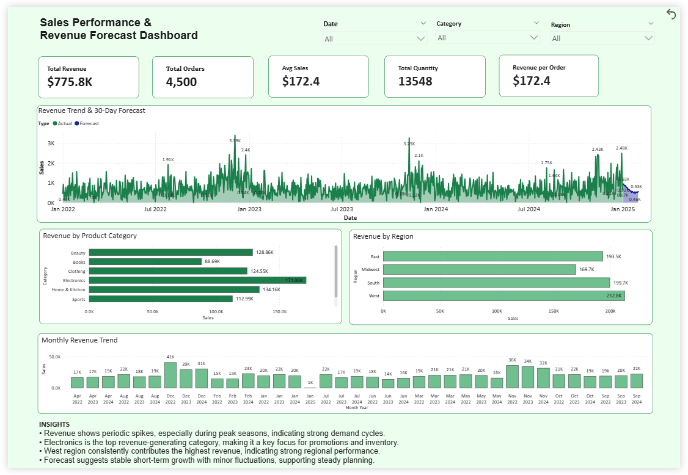

# Revenue Forecasting & Sales Intelligence System

## Overview
This project analyzes retail sales data to identify trends and forecast future revenue.

It focuses on building a simple, structured solution that combines data analysis, machine learning, and business insights.

---

## Tech Stack
- Python (Pandas, NumPy, Scikit-learn)  
- Power BI  
- Jupyter Notebook  

---

## Key Highlights
- Identified seasonal sales trends (peak during Nov–Dec)  
- Built a forecasting model for 30–60 day revenue prediction  
- Analyzed performance across regions and product categories  
- Delivered actionable business recommendations  

---

## Dashboard

---

## Project Structure
- `data/` → Dataset  
- `notebooks/` → Analysis & modeling  
- `outputs/` → Forecast results  
- `dashboard/` → Power BI dashboard  
- `docs/` → Executive Summary  

---

## Business Summary
A detailed executive summary is available in the `docs/` folder.

---

## Contact
- LinkedIn: https://www.linkedin.com/in/divyanshir/  
- Email: divyanshir.work@gmail.com  
